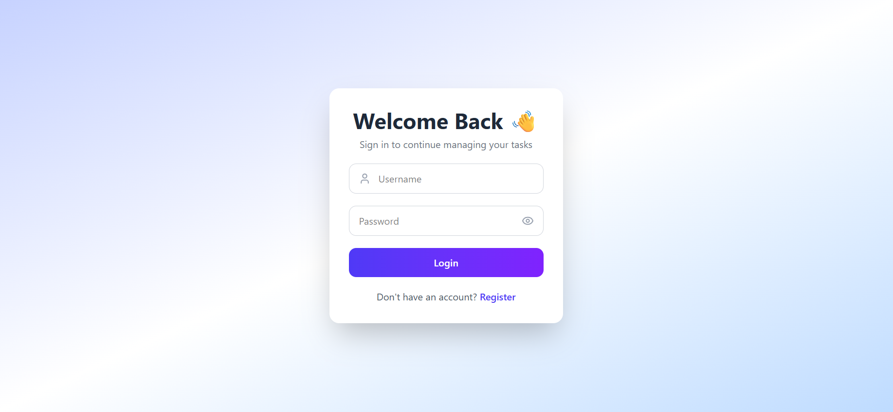
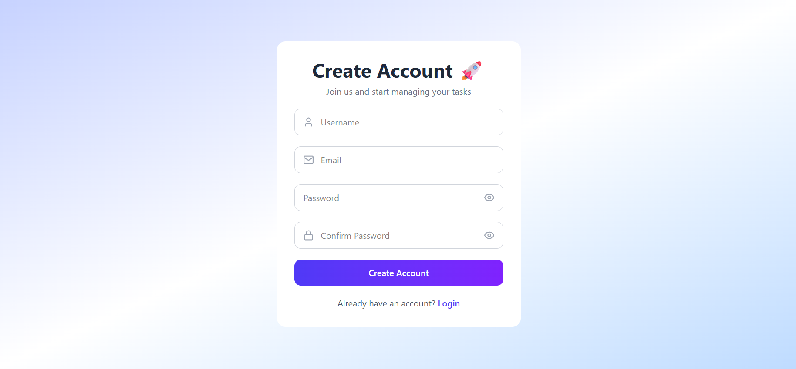
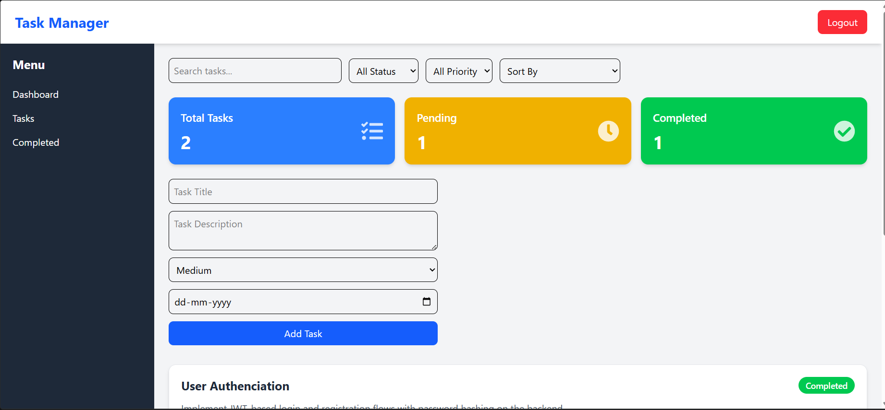
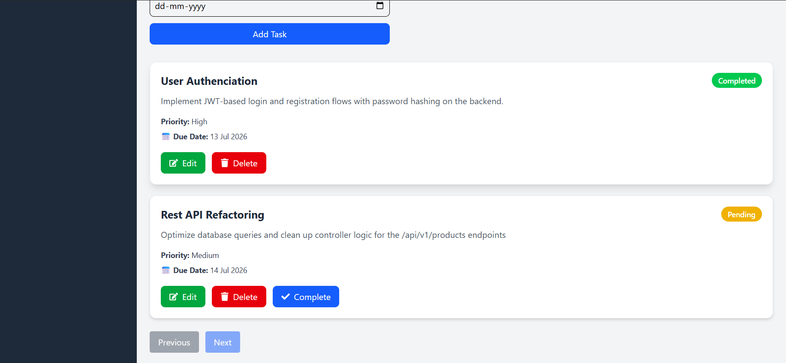

# 📋 Task Manager


A full-stack Task Manager application built using **Django**, **Django REST Framework**, **React**, **PostgreSQL**, **JWT Authentication**, and **Tailwind CSS**.

## 📸 Screenshots

### 🔐 Login Page



---

### 📝 Register Page



---

### 📊 Dashboard



---

### 📄 Pagination



## 🚀 Features

- 🔐 User Registration & Login
- 🔑 JWT Authentication
- ➕ Create Tasks
- ✏️ Edit Tasks
- 🗑️ Delete Tasks
- ✅ Mark Tasks as Completed
- 🔍 Search Tasks
- 🎯 Filter by Status
- ⚡ Filter by Priority
- ↕️ Sort Tasks
- 📄 Pagination
- 📊 Dashboard Statistics
- 🛡️ Protected Routes
- ⏳ Loading Spinner
- 📭 Empty State UI

---

## 🛠️ Tech Stack

### Frontend

- React
- React Router DOM
- Axios
- Tailwind CSS

### Backend

- Django
- Django REST Framework
- Simple JWT

### Database

- PostgreSQL

---

## 📂 Project Structure

```text
task-manager/
│
├── backend/
│   ├── config/
│   ├── tasks/
│   ├── users/
│   └── manage.py
│
├── frontend/
│   ├── src/
│   ├── public/
│   └── package.json
│
├── .gitignore
└── README.md
```

---

## ⚙️ Installation

### Clone the repository

```bash
git clone https://github.com/Unnati-singh-ai/task-manager.git
```

### Backend Setup

```bash
cd backend

python -m venv venv

venv\Scripts\activate

pip install -r requirements.txt

python manage.py migrate

python manage.py runserver
```

### Frontend Setup

```bash
cd frontend

npm install

npm run dev
```

---

## 💡 Skills Demonstrated

- Full Stack Development
- REST API Development
- JWT Authentication
- CRUD Operations
- React State Management
- API Integration
- PostgreSQL Database Design
- Git & GitHub

## 🎯 Future Improvements

- 🌙 Dark Mode
- 📅 Calendar View
- 🏷️ Task Categories
- 🔔 Notifications
- 👤 User Profile
- 📱 Fully Responsive Design

---

## 👩‍💻 Author

**Unnati Singh**

GitHub: **https://github.com/Unnati-singh-ai**

## 🌐 Live Demo
### Frontend
https://task-manager-xi-weld.vercel.app

### Backend API
https://task-manager-1-ohdy.onrender.com

